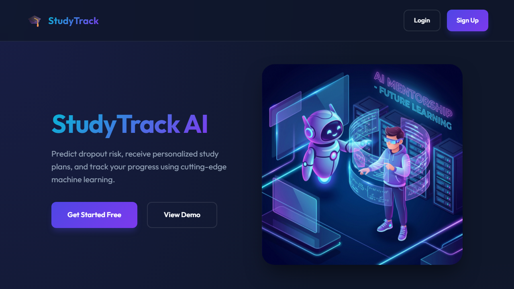
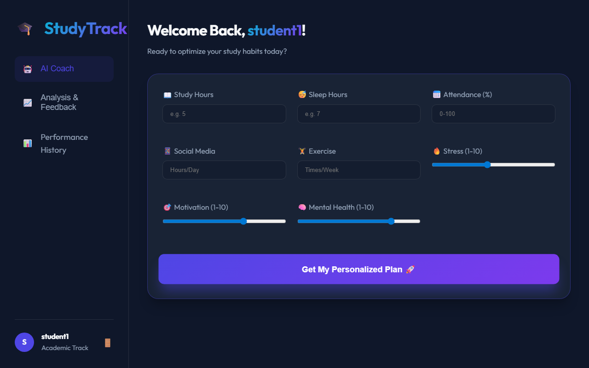
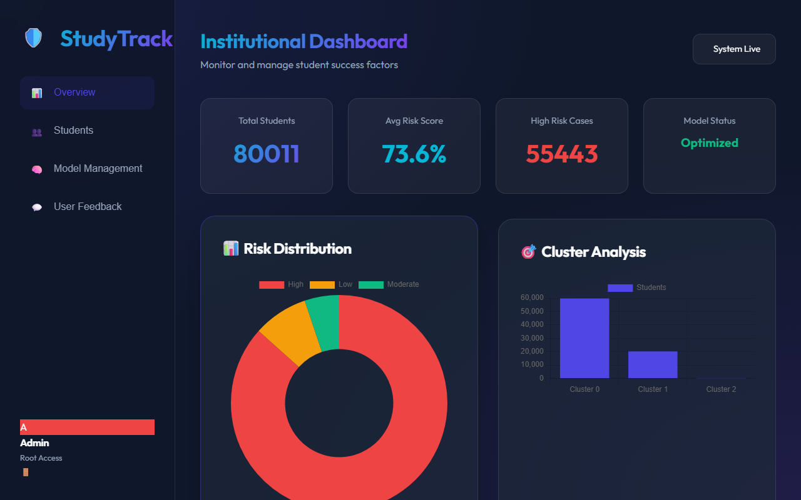

# StudyTrack AI - Student Dropout Prediction System

A machine learning-powered web application that predicts student dropout risk and provides personalized study recommendations using AI.

## 📸 Screenshots & Demo

### Application Demo

### Homepage


### Student Dashboard


### Admin Dashboard


## 🚀 Features

- **Dropout Risk Prediction**: ML models predict dropout probability based on student habits
- **AI-Powered Recommendations**: Personalized study advice using Groq LLM
- **Daily Habit Tracking**: Track study hours, sleep, attendance, and more
- **Student Clustering**: Group students by behavior patterns
- **Admin Dashboard**: Monitor all students and view analytics
- **Model Retraining**: Upload new datasets and retrain models
- **Returning User Detection**: Welcome back messages and progress tracking
- **Feedback System**: Students can rate recommendations

## 📋 Prerequisites

- Python 3.8+
- Groq API Key (get from https://console.groq.com/)

## 🛠️ Installation

1. **Clone or navigate to the project directory**
```powershell
cd d:\NOTES\StudyTrack\STSSHR
```

2. **Create and activate virtual environment**
```powershell
python -m venv .venv
.venv\Scripts\activate
```

3. **Install dependencies**
```powershell
pip install -r requirements.txt
```

4. **Set up environment variables**

Create a `.env` file in the project root:
```ini
GROQ_API_KEY=your_actual_groq_api_key_here
FLASK_SECRET_KEY=your_random_secret_key_here
FLASK_ENV=development
```

> **Important**: Get your free Groq API key from https://console.groq.com/

## 🚦 Running the Application

1. **Start the Flask server**
```powershell
python app.py
```

2. **Access the application**
- Homepage: http://localhost:5000
- Student Dashboard: http://localhost:5000/student
- Admin Dashboard: http://localhost:5000/admin
- Login Page: http://localhost:5000/login

## 👥 Default Credentials

### Admin Account
- Username: `admin`
- Password: `admin123`

### Student Account
- Username: `student1`
- Password: `student123`

> **Note**: Passwords are now securely hashed in the database.

## 📊 Database Schema

The application uses SQLite with the following tables:
- `users` - User authentication
- `students` - Student profiles
- `daily_habits` - Daily habit logs
- `predictions` - Dropout predictions
- `recommendations` - AI-generated recommendations
- `feedback` - Student feedback
- `model_retraining_history` - Model training history (NEW)
- `user_sessions` - Login session tracking (NEW)

## 🔧 API Endpoints

### Student Endpoints
- `POST /api/predict` - Get dropout prediction and save habits
- `POST /api/recommend` - Get AI recommendations
- `GET /api/student/check-returning-user/<id>` - Check returning user status (NEW)
- `POST /api/student/log-session` - Log user session (NEW)
- `GET /api/student/progress/<id>` - Get progress over time
- `POST /api/feedback/submit` - Submit feedback

### Admin Endpoints
- `GET /api/admin/stats` - Get dashboard statistics
- `GET /api/admin/students` - Get all students
- `POST /api/admin/upload-dataset` - Upload CSV for retraining
- `POST /api/admin/retrain-models` - Retrain ML models
- `GET /api/admin/retraining-history` - Get retraining history (NEW)
- `POST /api/admin/save-retraining-result` - Save retraining results (NEW)

### Authentication
- `POST /api/signup` - Create new account
- `POST /api/login` - Login
- `POST /api/logout` - Logout

## 🤖 Machine Learning Models

The system uses pre-trained models located in the `models/` directory:
- `rf_dropout_model.pkl` - Random Forest classifier for dropout prediction
- `kmeans_model.pkl` - K-Means clustering for student grouping
- `scaler.pkl` - Feature scaler
- `feature_columns.pkl` - Feature definitions

## 🆕 New Features

### Model Retraining Tracking
- Track every model retraining session
- View accuracy improvements over time
- Store dataset information and training duration
- Admin dashboard displays retraining history

### Returning User Experience
- Automatically detect returning users
- Show login count and habit tracking streak
- Display personalized welcome messages
- Prompt for new habit logs if not logged today

## 🔐 Security Features

✅ API keys stored in environment variables  
✅ Password hashing using Werkzeug  
✅ Flask secret key for session security  
✅ .gitignore to protect sensitive data

## 📁 Project Structure

```
STSSHR/
├── app.py                 # Main Flask application
├── new_endpoints.py       # New feature endpoints
├── requirements.txt       # Python dependencies
├── .env                   # Environment variables (create this)
├── .env.example          # Environment template
├── .gitignore            # Git ignore rules
├── models/               # ML models
│   ├── rf_dropout_model.pkl
│   ├── kmeans_model.pkl
│   ├── scaler.pkl
│   └── feature_columns.pkl
├── templates/            # HTML templates
│   ├── index.html
│   ├── login.html
│   ├── signup.html
│   ├── student_dashboard.html
│   ├── admin_dashboard.html
│   └── student_progress.html
├── static/               # Static files (CSS/JS)
├── uploads/              # Uploaded datasets
└── studytrack.db         # SQLite database
```

## 🐛 Troubleshooting

### "GROQ_API_KEY not found" Warning
Make sure you've created a `.env` file with your Groq API key.

### Database Errors
Delete `studytrack.db` and restart the app to recreate the database with the correct schema.

### Missing Dependencies
Run `pip install -r requirements.txt` to install all required packages.

### Port 5000 Already in Use
Change the port in `app.py` line 1516: `app.run(debug=True, port=5001)`

## 📝 Usage Guide

### For Students
1. Login or signup for an account
2. Fill out the daily habits form with your current behaviors
3. Submit to get your dropout risk assessment
4. Review personalized AI recommendations
5. Check your progress over time in the Progress page
6. Provide feedback to help improve the system

### For Administrators
1. Login with admin credentials
2. View all students and their risk levels
3. Check system-wide analytics
4. Upload new datasets (CSV format)
5. Retrain models with new data
6. View retraining history and model performance trends
7. Review student feedback

## 🔄 Updates in This Version

- ✅ Fixed security vulnerability: API key now in environment variables
- ✅ Added password hashing for secure authentication
- ✅ Fixed database table references (daily_habits)
- ✅ Created requirements.txt for easy dependency installation
- ✅ Added .gitignore to protect sensitive data
- ✅ NEW: Model retraining history tracking
- ✅ NEW: Returning user detection and session management
- ✅ Improved error handling throughout the application

## 📄 License

This project is for educational purposes.

## 👨‍💻 Support

For issues or questions, please check the code comments or error messages in the browser console (F12).
